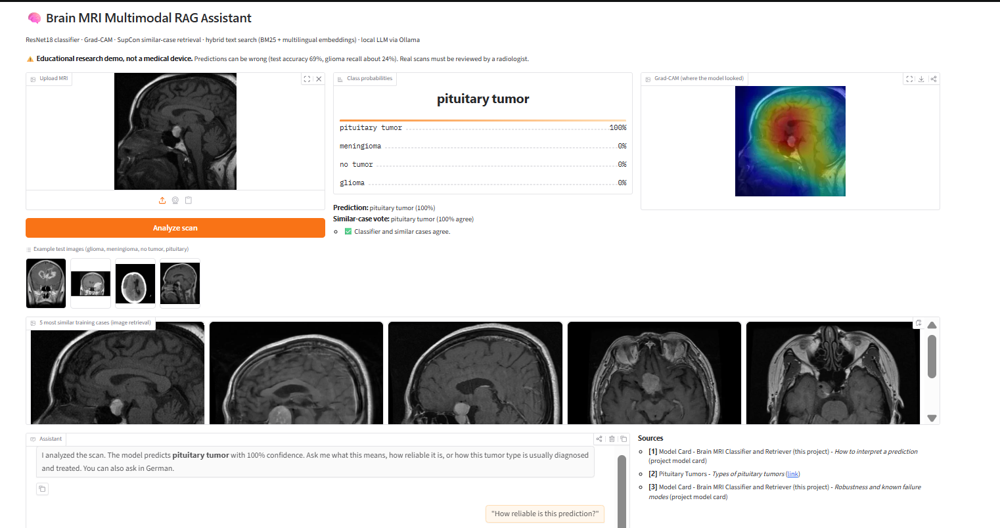
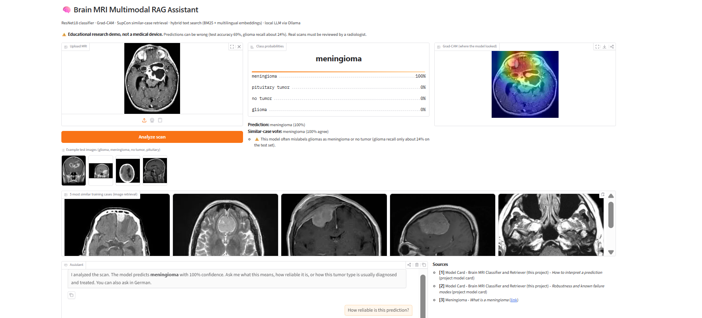
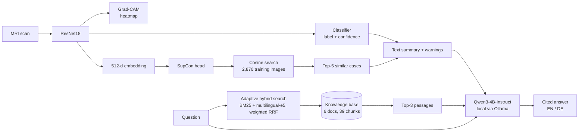
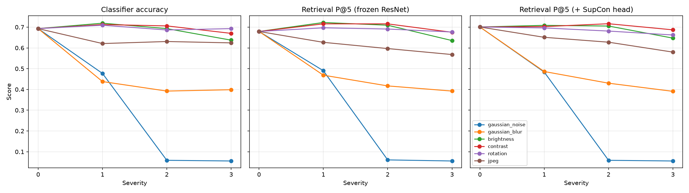

# 🧠 Explainable Brain MRI Assistant: Multimodal RAG with a Local LLM


An end-to-end **multimodal retrieval-augmented generation (RAG)** system for brain MRI. It classifies a scan,
explains the prediction with Grad-CAM, retrieves the most similar past cases, retrieves cited medical text,
and lets a **local LLM** answer free-form questions in **English or German**. Everything runs **offline on a
CPU-only laptop**, so no data leaves the machine (important for GDPR in medical settings).

The focus of this project is **honest evaluation**: every component is measured, and the measurements
uncovered data leakage, a dangerous failure mode, a cross-lingual retrieval bug and an LLM reasoning-leak bug,
each of which was fixed and re-measured.

> ⚠️ **Educational research project, not a medical device.** Test accuracy is 69% and glioma recall is only 24%.
> Predictions must never be used for diagnosis. Real scans must be reviewed by a radiologist.

| ✅ Correct prediction: Grad-CAM focuses on the pituitary mass | ⚠️ A glioma misclassified as meningioma with 100% confidence: the assistant's warning still fires |
|---|---|
|  |  |

The second example shows why the reliability layer matters: **high confidence does not mean correct.**

---

## What it does

Upload an MRI and the app shows:

1. **Prediction:** ResNet18 classifier (glioma / meningioma / pituitary tumor / no tumor) with confidence.
2. **Grad-CAM heatmap:** where the model looked.
3. **5 most similar training cases:** content-based image retrieval with a contrastive (SupCon) embedding.
4. **Reliability warnings:** low confidence, classifier vs. similar-case disagreement, known weak classes.
5. **Chat assistant:** answers questions such as *"How reliable is this prediction?"* or
   *"Wie wird diese Art von Tumor behandelt?"*, grounded in the analysis and in cited passages from NCI, NINDS,
   Cancer Research UK and RadiologyInfo, with `[1]`, `[2]` citations.

## Architecture



Two independent retrieval paths make it multimodal: **image → image** (similar cases) and **text → text**
(medical passages). The predicted class name is added to the text query so that passages about the right tumor
type are found. The LLM receives a text summary of the image analysis plus the retrieved passages.

## Results

All results come from the scripts in `Notebooks/` and are stored in `results/`.

### 1. Classifier: data leakage found

| Evaluation | Test images | Accuracy |
|---|---|---|
| Validation (split of the training folder) | 574 | ~97% |
| Test set as provided | 394 | 76.1% |
| **Test set, duplicates removed** | **306** | **69.3%** |

An MD5 hash check found **88 test images that are exact copies of training images** (all *no tumor*),
which inflated test accuracy by about 7 points. All results below use the de-duplicated test set.
Glioma recall is only **24%**: most gliomas are predicted as meningioma or no tumor.

### 2. Image retrieval (similar cases)

| Embedding | P@5 (test queries → training gallery) |
|---|---|
| Fine-tuned ResNet18 features | 0.679 |
| **+ supervised contrastive (SupCon) head** | **0.701** |

### 3. Robustness: a dangerous failure mode

Classifier accuracy under image corruptions (clean: 69.3%). Severity 1 → 3:

| Corruption | Sev. 1 | Sev. 2 | Sev. 3 |
|---|---|---|---|
| Brightness | 71.9% | 69.3% | 63.7% |
| Contrast | 71.2% | 70.6% | 67.0% |
| Rotation (10°/20°/30°) | 70.9% | 68.6% | 69.3% |
| JPEG compression | 62.1% | 63.1% | 62.4% |
| Gaussian blur | 43.8% | 39.2% | 39.9% |
| **Gaussian noise** | 47.7% | **5.9%** | **5.6%** |

Robustness follows the training augmentation (brightness, contrast and rotation were augmented; noise and blur
were not). Under noise the model **predicts "no tumor" for every image**: 5.6% = the 17 *no tumor* images out of
306. A model that answers "no tumor" for low-quality scans is the most dangerous kind of failure.



### 4. Knowledge-base retrieval (30 labelled questions, 5 in German)

| Method | hit@1 | hit@3 | MRR | German hit@3 |
|---|---|---|---|---|
| BM25 (keywords) | 0.63 | 0.87 | 0.73 | 0.2 |
| Dense (multilingual-e5-small) | 0.93 | 1.00 | 0.97 | 1.0 |
| Hybrid, standard RRF | 0.83 | 0.90 | 0.86 | 0.4 |
| **Hybrid, query-adaptive RRF** | **0.97** | **1.00** | **0.98** | **1.0** |

Standard hybrid search was *worse* than dense search alone: German questions share no words with the English
documents, so BM25 returns an essentially random ranking that RRF still weights equally. **Query-adaptive
fusion** weights BM25 by the share of query words found in the corpus vocabulary (0% for German, 50–100% for
English), which fixed it and gave the best overall scores.

### 5. LLM evaluation (26 test cases)

Rule-based checks for correctness, citations, language, safety, abstention and reasoning leakage:

| Metric | Qwen3-4B (thinking) | + no-think template | **Qwen3-4B-Instruct + prompt fixes** |
|---|---|---|---|
| Fact recall | 100%* | 88% | **100%** |
| Answers with citations | 86% | 90% | **100%** |
| German questions answered in German | 0% | 20% | **100%** |
| No leaked reasoning | 15% | 73% | **100%** |
| No diagnostic claims | 100% | 100% | **100%** |
| Refers to a radiologist (image questions) | 25% | 25% | **100%** |
| Flags unreliable predictions | 100% | 100% | 75% |
| Abstains on out-of-scope questions | 60% | 60% | **100%** |
| Median latency per answer (CPU) | 41 s | 67 s | **26 s** |

\*inflated: answers mostly consisted of the model's reasoning, which quotes the passages.

The evaluation found that the default `qwen3:4b` build always "thinks": its reasoning leaked into answers,
German questions were answered in English, and it invented answers (e.g. survival rates) that are not in the
knowledge base. Switching to the instruct model and tightening the prompt fixed this and made answers
**2.5× faster**.

## Key findings

1. **Data leakage:** 88 duplicated images inflated test accuracy from 69% to 76%.
2. **Silent failure:** under Gaussian noise the classifier outputs "no tumor" for every scan.
3. **Shared blind spots:** classifier and similar-case retrieval use the same backbone, so for a misclassified
   glioma all 5 retrieved cases were also meningiomas. Retrieval agreement is not an independent second opinion.
4. **Cross-lingual hybrid search:** standard RRF hurts non-English queries; query-adaptive weighting fixes it.
5. **LLM evaluation catches real bugs:** reasoning leakage, wrong answer language and ungrounded answers were
   only visible because answers were tested automatically.

## Tech stack

| Area | Tools |
|---|---|
| Vision | PyTorch, torchvision (ResNet18, transfer learning), Grad-CAM, supervised contrastive learning |
| Retrieval | sentence-transformers (`intfloat/multilingual-e5-small`), rank-bm25, weighted Reciprocal Rank Fusion |
| LLM | Ollama, Qwen3-4B-Instruct (quantized, CPU), streaming |
| App | Gradio |
| MLOps | Docker, Docker Compose, pytest (19 tests), ruff, GitHub Actions, GitHub Container Registry |

Hardware: Intel i5-12450H laptop, 16 GB RAM, **no GPU**.

## Project structure

```
├── Notebooks/
│   ├── 01_dataset_exploration.ipynb   # data analysis, leakage check, training, embeddings
│   ├── 02_contrastive_head.py         # SupCon head + retrieval evaluation
│   ├── 03_robustness.py               # corruption robustness tests
│   ├── 04_hybrid_search.py            # knowledge-base index + retrieval evaluation (+ CI quality gate)
│   ├── 05_test_assistant.py           # end-to-end assistant test
│   ├── 06_llm_eval.py                 # LLM evaluation suite
│   ├── kb_search.py                   # hybrid search library
│   ├── mri_assistant.py               # multimodal RAG assistant
│   └── app.py                         # Gradio web app
├── knowledge_base/                    # 6 cited medical documents + model card
├── models/                            # SupCon head, gallery embeddings, KB index
├── results/                           # evaluation CSVs and figures
├── tests/                             # pytest suite (runs without dataset or GPU)
├── Dockerfile, docker-compose*.yml
└── .github/workflows/ci.yml           # lint → tests → retrieval quality gate → Docker image
```

## How to run

### Option A: Docker (recommended)

Requires Docker Desktop and [Ollama](https://ollama.com) on the host.

```bash
ollama pull qwen3:4b-instruct
docker compose -f docker-compose.host-ollama.yml up --build
# open http://localhost:7860
```

Or run everything, including Ollama, in containers: `docker compose up --build`.

### Option B: Local Python

```bash
pip install torch torchvision --index-url https://download.pytorch.org/whl/cpu
pip install -r requirements.txt
ollama pull qwen3:4b-instruct
cd Notebooks
python 04_hybrid_search.py      # builds the knowledge-base index
python app.py                   # http://127.0.0.1:7860
```

The dataset is optional for the app. To reproduce training and evaluation, download it into
`Data/brain_tumor/Training` and `Data/brain_tumor/Testing`.

### Tests and evaluation

```bash
pytest                                  # 19 tests, no dataset or GPU needed
ruff check .
cd Notebooks && python 06_llm_eval.py   # LLM evaluation (~10 min on CPU)
```

## CI/CD

GitHub Actions runs on every push and pull request:

1. **Lint:** ruff
2. **Tests:** pytest with fake models, so CI needs no dataset or GPU
3. **Quality gate:** rebuilds the retrieval index and **fails the build if hit@3 < 0.9**
4. **Docker:** builds the image and publishes it to GitHub Container Registry on `main`

## Limitations and future work

- **Dataset:** a public Kaggle dataset with mixed sources, a noisy test split and duplicates. Results should be
  confirmed on an external dataset (e.g. Figshare brain tumor dataset).
- **Robustness:** retrain with noise and blur augmentation to remove the "no tumor" collapse.
- **Independent retrieval:** use a separate medical embedding model (e.g. BiomedCLIP) so that similar-case
  retrieval is a real second opinion.
- **Vision-language model:** the LLM only sees a text summary of the image. A VLM (e.g. Qwen2.5-VL) could
  read the scan directly (too slow on CPU for this project).
- **Knowledge base:** 6 documents only. A larger corpus would need a vector database (FAISS, Qdrant).
- **German quality:** a 4B model occasionally makes grammar and terminology mistakes in German.

## Data and sources

- MRI images: Kaggle "Brain Tumor Classification (MRI)" dataset (not redistributed, see its license).
- Knowledge base: summarized from the [National Cancer Institute](https://www.cancer.gov/types/brain/patient/adult-brain-treatment-pdq),
  [NINDS](https://www.ninds.nih.gov/health-information/disorders/brain-and-spinal-cord-tumors),
  [Cancer Research UK](https://www.cancerresearchuk.org/about-cancer/brain-tumours/types/meningioma),
  [NCI Pituitary Tumors PDQ](https://www.ncbi.nlm.nih.gov/books/NBK66024/) and
  [RadiologyInfo](https://www.radiologyinfo.org/en/info/mri-brain).

## Author

**Srikar Maddala**: [LinkedIn](https://www.linkedin.com/in/YOUR-PROFILE) · [GitHub](https://github.com/YOUR-USERNAME)
